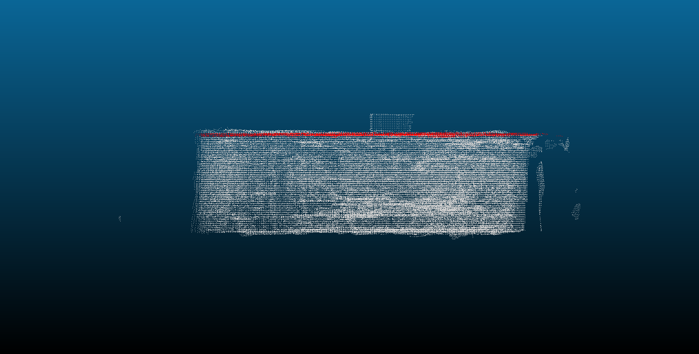

# 3D Point Cloud Analysis: "Smart Segmentation"

This tool processes large-scale 3D scan data (`.ply`), automatically segments the dominant architectural structures, and calculates room height by intelligently handling coordinate system orientation and clutter. The input scan file(Dusseldorf.ply) consists of 29,163,226 points as shown in the figure below.


The input file is downsampled to 324,095 points and the ceiling is detected(Dusseldorf_preview.ply) and labeled in red color. The height is also displayed (2.73m) when running the script.



---

## 🛠️ Setup & Installation

**Prerequisites:** Python 3.8+ (Linux/Ubuntu recommended for heavy 3D processing)

### 1. System Dependencies (Linux/Codespaces)
To prevent Open3D crashes on headless servers (like GitHub Codespaces or CI/CD pipelines), install the OpenGL drivers first:
```bash
sudo apt-get update
sudo apt-get install -y libgl1 libgomp1
```

### 2. Python Dependencies
Install the necessary computational libraries:
```bash
pip install -r requirements.txt
```

### 3. Run the Tool
The tool can be used by running the main file.
```bash 
python main.py
```
